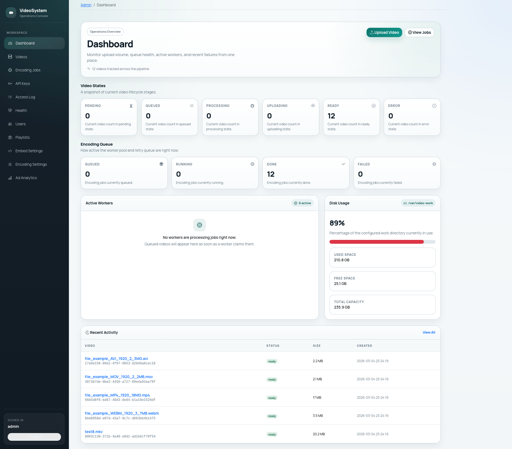
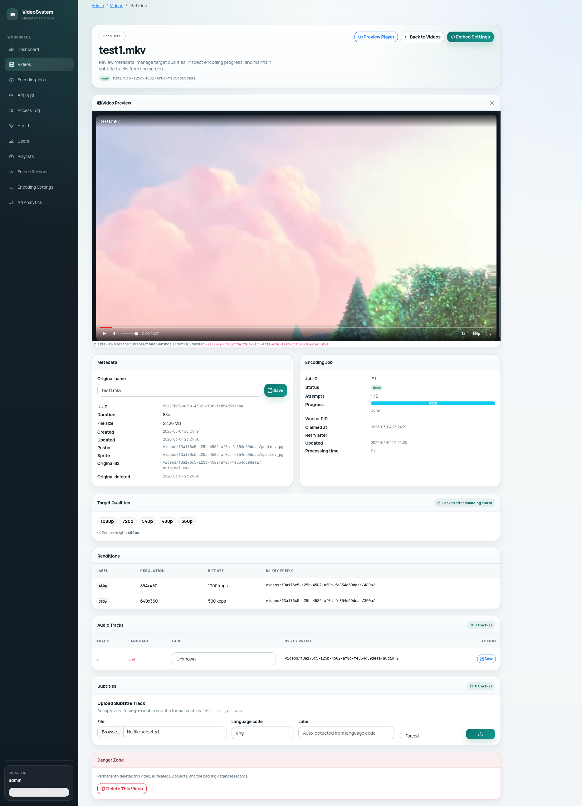
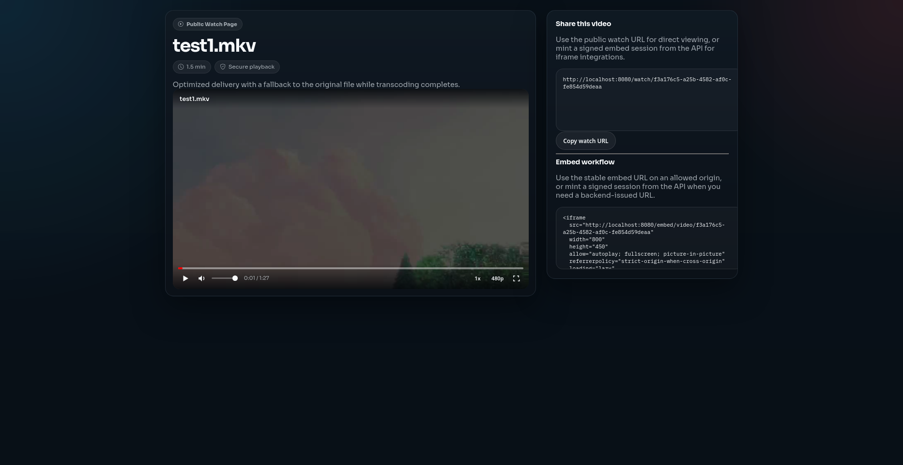

# PHP HLS Video Platform

> **PHP 8.4 · MySQL 8 · FFmpeg 6 · Nginx · Backblaze B2 · Supervisor**

A self-hosted video platform for **upload, async transcoding, and encrypted HLS delivery**. Server-side PHP only — no Node.js, no Redis, no microservices. All durable storage lives in Backblaze B2; all encoding runs on the VPS via FFmpeg.

---

## What It Is

An alternative to Vimeo / Wistia / Brightcove that you deploy on your own infrastructure. You own the files, the viewer data, and the delivery pipeline.

| | YouTube | Vimeo Pro | **This system** |
|---|---|---|---|
| Monthly cost | Free (ads) | $20–$75 | ~$10–$20 (server + B2) |
| Your branding only | ❌ | ⚠️ Premium only | ✅ |
| Viewer data stays yours | ❌ | ❌ | ✅ |
| Works inside a paywall / LMS | ❌ | ⚠️ | ✅ |
| Unlimited storage | ❌ | ❌ | ✅ (~$6/TB/month on B2) |

**Who it's for:** online course platforms, membership/paywall sites, media companies, agencies building white-label video back-ends.

---

## Screenshots

<p align="center">
  <br><em>Admin dashboard — job queue, disk health, recent failures</em>
</p>
<p align="center">
  <br><em>Video detail — renditions, subtitles, embed settings</em>
</p>
<p align="center">
  <br><em>Custom HLS player — quality switching, subtitles, seek sprites</em>
</p>

---

## Key Engineering Decisions

These are the non-obvious choices that drive the design:

**1. DB-backed poll queue — no Redis**
Jobs are claimed with `SELECT … FOR UPDATE SKIP LOCKED` (MySQL 8 / MariaDB 10.6). A `heartbeat_at` timestamp updated every ~2 s during active encoding lets a separate reaper process detect crashed workers without PID-based tricks (PID recycling risk eliminated). Workers can run as multiple Supervisor processes without coordination overhead.

**2. Two-step B2 direct upload — server never buffers video bytes**
`POST /api/upload/init` inserts a `pending` video row and returns a presigned B2 PUT URL. The client streams the file directly to B2; the server's PHP-FPM pool never touches it. `POST /api/upload/complete` verifies the file via `HeadObject` (no download), reads the authoritative size from B2, then atomically transitions the row to `queued` and inserts the encoding job. Files >5 GB use the B2 multipart API (presigned per-part URLs).

**3. AES-128 HLS encryption with keys encrypted at rest**
Each video gets a unique AES-128 key generated during processing. Before the key is written to MySQL it is AES-256-CBC encrypted with `KEY_ENCRYPTION_SECRET`. Raw key bytes exist on disk only during an active FFmpeg run (written to a temp keyinfo file, deleted immediately after). The key delivery endpoint (`GET /api/keys/{uuid}/{keyIndex}`) validates a short-lived stream token before serving the raw 16-byte key with `Cache-Control: no-store`.

**4. Graceful worker shutdown via cooperative flag**
Signal handlers set a static `ShutdownFlag`. The encoding pipeline checks the flag at rendition boundaries — SIGTERM lets the current rendition finish, then exits cleanly. No mid-segment corruption, no orphaned FFmpeg processes.

**5. Crash recovery**
On worker startup: scan `WORK_DIR` for stale AES key files left by crashed processes and delete them. Before retrying a claimed job: run a mandatory B2 prefix cleanup to delete any partially uploaded segments from the previous attempt. The reaper runs as a *separate* Supervisor process (not inside the worker loop) to avoid a crashed worker taking the reaper with it.

**6. Pixel-count-weighted progress tracking**
Encoding progress is not equal-weight across renditions. 1080p encodes far more pixels than 360p. Each rendition's contribution is weighted by `width × height`, so `progress_pct` advances proportionally to actual computational work rather than jumping 20% per rendition.

**7. Embed security via signed tokens + CSP**
`POST /api/videos/{uuid}/embed-sessions` issues a signed embed token that encodes `parent_origin` and a TTL. The embed page derives its `Content-Security-Policy: frame-ancestors` value directly from the token — no runtime DB lookup. The player's postMessage command channel validates the incoming event origin against the same value.

---

## Features

- **Two-step B2 direct upload** — single-part (<5 GB) and multipart (≥5 GB); presigned PUT URLs; server never buffers video data
- **Async encoding queue** — DB-backed `SELECT … FOR UPDATE SKIP LOCKED`; no external queue service
- **5-rung adaptive HLS ladder** — 1080p / 720p / 540p / 480p / 360p; upscaling automatically skipped based on source height
- **AES-128 segment encryption** — per-video key, stored AES-256 encrypted at rest, never cached on disk
- **Alternate audio tracks** — multiple language tracks extracted into separate HLS audio renditions
- **WebVTT subtitle extraction** — all text tracks extracted, uploaded to B2, served via bootstrap JSON
- **Thumbnail + seek sprite** — poster at video midpoint + NxM sprite sheet for timeline hover previews
- **Progressive fallback** — original file uploaded to B2 at intake; players can fall back to it while HLS is being prepared
- **Signed stream tokens** — HMAC-SHA256, IP-bindable, configurable TTL; HttpOnly cookie (browser) or query param (non-browser)
- **Signed embed sessions** — iframe-embeddable player with per-origin CSP, postMessage command channel
- **Admin dashboard** — videos, jobs, API keys, access log, playlists, ad analytics, health page
- **Video ads** — preroll / midroll (cue points by seconds or %) / postroll; VAST wrapper resolution; skip-delay; click-through
- **Health check** — DB ping + disk check; suitable for load-balancer probes

---

## Requirements

| Dependency | Minimum version |
|---|---|
| PHP | 8.4 (extensions: `pdo_mysql`, `pcntl`, `openssl`, `json`, `mbstring`) |
| MySQL / MariaDB | 8.0+ / 10.6+ (`SKIP LOCKED` required) |
| FFmpeg | 6.0+ (`libx264` + native AAC encoder) |
| Nginx | any recent stable |
| Supervisor | any recent stable |
| Composer | 2.x |
| Backblaze B2 | private bucket, S3-compatible API |

---

## Quick Start (development)

```bash
git clone https://github.com/Mahmoud-s-Khedr/upVideoPHP.git upVideoPHP && cd upVideoPHP
./scripts/deploy-dev.sh
```

Bootstraps a full Docker stack: Nginx, PHP-FPM, MySQL 8, MinIO (B2-compatible), the encoding worker, and the stale-job reaper. The script exits only after `http://localhost:8080/health` returns 200.

See **[docs/dev-deployment.md](docs/dev-deployment.md)** for day-to-day Docker workflow.
See **[docs/deployment.md](docs/deployment.md)** and **[scripts/deploy-prod.sh](scripts/deploy-prod.sh)** for production VPS setup.

---

## Architecture

```
                          ┌─────────────────────────────────────────┐
CLIENT                    │  Upload flow (two-step)                  │
  │                       │                                          │
  │  POST /api/upload/init │  1. Insert video (status=pending)        │
  │──────────────────────►│  2. Generate presigned B2 PUT URL        │
  │◄──────────────────────│  3. Return { video_uuid, upload_url }    │
  │                       └─────────────────────────────────────────┘
  │
  │  PUT {upload_url}  (direct to B2 — PHP never sees the bytes)
  │─────────────────────────────────────────────────────► Backblaze B2
  │◄─────────────────────────────────────────────────────
  │
  │  POST /api/upload/complete
  │──────────────────────►  HeadObject verify → status=queued → INSERT encoding_job
  │◄──────────────────────  202 { video_uuid, status: "queued" }

Worker (Supervisor — N processes)
  ├─ SELECT … FOR UPDATE SKIP LOCKED
  ├─ ffprobe analysis → store duration, source height
  ├─ Generate AES-128 key → encrypt → INSERT encryption_keys
  ├─ Extract audio tracks → per-language HLS playlists → B2
  ├─ Extract WebVTT subtitles → B2
  ├─ Encode renditions sequentially (1080p → … → 360p)
  │    └─ FFmpeg HLS + AES-128 (-hls_key_info_file) per rendition → B2
  ├─ Generate poster.jpg + sprite.jpg → B2
  ├─ Build master.m3u8 → B2
  ├─ Delete B2 original + local work dir
  └─ SET status = 'ready'

Reaper (Supervisor — 1 process, separate from workers)
  └─ Every 5 min: reset encoding_jobs WHERE heartbeat_at < NOW() - STALE_JOB_TIMEOUT_MINUTES

Player
  │  POST /api/videos/{uuid}/token           → HttpOnly stream_token cookie
  │  GET  /api/stream/{uuid}/master.m3u8     → rewritten playlist (token-gated)
  │  GET  /api/stream/{uuid}/720p/seg00001.ts → 302 to presigned B2 URL
  │  GET  /api/keys/{uuid}/0                 → raw 16-byte AES-128 key (token-gated)
  ▼
  Backblaze B2 (private bucket — segments delivered only via presigned redirects)
```

---

## API Reference

All endpoints require `Authorization: Bearer <api_key>` unless noted.

### Upload

| Method | Path | Description |
|--------|------|-------------|
| `POST` | `/api/upload/init` | **Step 1** — validate metadata, insert pending video row, return presigned B2 PUT URL |
| `PUT` | `{upload_url}` | **Step 2** — client streams file directly to B2 (not a server endpoint) |
| `POST` | `/api/upload/complete` | **Step 3** — verify file in B2 via HeadObject, queue encoding job |
| `POST` | `/api/upload/{uuid}/parts` | Multipart only — return presigned PUT URLs for individual parts |
| `POST` | `/api/upload/{uuid}/complete-multipart` | Multipart only — finalize multipart upload, then queue encoding job |

#### Init request

```json
{
  "filename": "lecture-01.mp4",
  "size_bytes": 1073741824,
  "content_type": "video/mp4",
  "target_qualities": ["720p", "480p"]
}
```

Accepted `content_type` values: `video/mp4`, `video/x-matroska`, `video/mp2t`, `video/x-msvideo`, `video/quicktime`, `video/webm`.
`target_qualities` is optional; omit to encode all applicable rungs. Upscaling is always prevented regardless.

#### Init response `201`

```json
{
  "video_uuid": "550e8400-e29b-41d4-a716-446655440000",
  "upload_mode": "single",
  "upload_url": "https://s3.us-west-004.backblazeb2.com/...presigned...",
  "b2_key": "videos/550e8400-.../original.mp4",
  "expires_in": 14400,
  "part_size_bytes": null,
  "total_parts": null,
  "created_at": "2026-03-01T10:00:00+00:00"
}
```

For files ≥5 GB: `upload_mode` is `"multipart"`, `part_size_bytes` and `total_parts` are populated, `upload_url` is null (use `/parts` endpoint).

#### Complete response `202`

```json
{
  "video_uuid": "550e8400-e29b-41d4-a716-446655440000",
  "video_id": 42,
  "status": "queued",
  "created_at": "2026-03-01T10:00:05+00:00"
}
```

### Video management

| Method | Path | Description |
|--------|------|-------------|
| `GET` | `/api/videos/{uuid}` | Metadata, status, renditions, subtitles, poster URL |
| `GET` | `/api/videos/{uuid}/progress` | Encoding progress 0–100, current rendition, current stage |
| `POST` | `/api/videos/{uuid}/token` | Issue stream token — HttpOnly cookie (browser) or JSON (non-browser) |
| `GET` | `/api/videos/{uuid}/original` | Presigned original-file URL + audio/subtitle track metadata |
| `POST` | `/api/videos/{uuid}/embed-sessions` | Mint signed public embed URL (bound to `parent_origin`) |
| `DELETE` | `/api/videos/{uuid}` | Delete video and all B2 objects |
| `DELETE` | `/api/videos/{uuid}/audio-tracks/{index}` | Remove audio track; rebuilds master.m3u8 for ready videos |

#### Progress response

```json
{
  "video_uuid": "550e8400-...",
  "status": "processing",
  "progress_pct": 47,
  "current_rendition": "720p",
  "current_stage": "transcode_720p"
}
```

#### Original playback response

```json
{
  "video_url": "https://...presigned-b2-url...",
  "expires_at": "2026-03-01T10:15:00+00:00",
  "audio_tracks": [
    { "track_index": 0, "language_code": "eng", "label": "English" }
  ],
  "subtitle_tracks": [
    { "language_code": "eng", "label": "English", "is_forced": false, "vtt_url": "https://..." }
  ]
}
```

### Streaming (stream token required)

| Method | Path | Description |
|--------|------|-------------|
| `GET` | `/api/stream/{uuid}/master.m3u8` | Rewritten master HLS playlist |
| `GET` | `/api/stream/{uuid}/{label}/index.m3u8` | Rendition playlist (`label`: `1080p`, `720p`, …) |
| `GET` | `/api/stream/{uuid}/{label}/{segment}.ts` | 302 redirect to presigned B2 segment |
| `GET` | `/api/stream/{uuid}/audio_{index}/index.m3u8` | Alternate audio playlist |
| `GET` | `/api/stream/{uuid}/audio_{index}/{segment}.ts` | 302 redirect to presigned B2 audio segment |
| `GET` | `/api/stream/{uuid}/subtitles/{trackIndex}.vtt` | WebVTT subtitle file |
| `GET` | `/api/keys/{uuid}/{keyIndex}` | Raw 16-byte AES-128 decryption key |

### Other

| Method | Path | Auth | Description |
|--------|------|------|-------------|
| `GET` | `/api/playlists/{uuid}` | API key | Curated playlist metadata + ordered ready videos |
| `POST` | `/api/ad-event` | — | Ad impression/interaction tracking (start, skip, complete, click) |
| `GET` | `/health` | — | DB ping + disk check (load-balancer probe) |

### Public playback

| Method | Path | Auth | Description |
|--------|------|------|-------------|
| `GET` | `/watch/{uuid}` | — | Standalone public watch page |
| `GET` | `/embed/{embedToken}` | Signed embed token in path | Public iframe player |
| `GET` | `/embed/{embedToken}/bootstrap.json` | Signed embed token in path | Playback bootstrap JSON |

#### Token issuance

```bash
# Browser — sets HttpOnly stream_token cookie, returns playlist URL
curl -X POST https://yourdomain.com/api/videos/{uuid}/token \
     -H "Authorization: Bearer <api_key>"

# Non-browser — returns token in JSON for query-param use
curl -X POST "https://yourdomain.com/api/videos/{uuid}/token?format=token" \
     -H "Authorization: Bearer <api_key>"
```

---

## Configuration Reference

All settings live in `.env` (copy from `.env.example`; never commit).

| Variable | Required | Default | Description |
|---|---|---|---|
| `DB_HOST` | ✅ | — | MySQL host |
| `DB_PORT` | | `3306` | MySQL port |
| `DB_NAME` | ✅ | — | Database name |
| `DB_USER` | ✅ | — | Database user |
| `DB_PASS` | | `''` | Database password |
| `B2_KEY_ID` | ✅ | — | B2 application key ID |
| `B2_APP_KEY` | ✅ | — | B2 application key secret |
| `B2_BUCKET` | ✅ | — | B2 bucket name |
| `B2_ENDPOINT` | ✅ | — | B2 S3-compatible endpoint URL |
| `B2_REGION` | ✅ | — | B2 region (e.g. `us-west-004`) |
| `B2_PUBLIC_ENDPOINT` | | `B2_ENDPOINT` | Public-facing URL embedded in presigned PUT URLs returned to browsers (useful when PHP and browser reach B2 through different hostnames) |
| `B2_UPLOAD_PRESIGN_TTL_SECONDS` | | `14400` | Presigned PUT URL lifetime (4 h) |
| `STREAM_TOKEN_SECRET` | ✅ | — | HMAC key for stream tokens (`openssl rand -base64 48`) |
| `STREAM_TOKEN_TTL_SECONDS` | | `14400` | Stream token lifetime (4 h) |
| `EMBED_TOKEN_SECRET` | ✅ | — | HMAC key for signed embed URLs |
| `EMBED_TOKEN_TTL_SECONDS` | | `14400` | Default embed URL lifetime (4 h) |
| `KEY_ENCRYPTION_SECRET` | ✅ | — | 64-char hex (32 bytes) — AES-256 key for encrypting HLS keys at rest (`openssl rand -hex 32`) |
| `APP_BASE_URL` | ✅ | — | Public HTTPS base URL — embedded in HLS playlists; wrong value = playback failure |
| `TRUSTED_PROXIES` | | `''` | Comma-separated IPs whose `X-Forwarded-For` is trusted for IP-bound stream tokens |
| `CORS_ALLOWED_ORIGIN` | | `''` | Browser CORS origin; empty = CORS disabled |
| `FFMPEG_BIN` | | `/usr/bin/ffmpeg` | FFmpeg binary path |
| `FFPROBE_BIN` | | `/usr/bin/ffprobe` | ffprobe binary path |
| `FFMPEG_MAX_MINUTES` | | `360` | Hard timeout per FFmpeg rendition process |
| `WORK_DIR` | | `/var/video-work` | Local encoding work directory (outside web root; ≥20 GB free recommended) |
| `MAX_UPLOAD_BYTES` | | `21474836480` | 20 GB upload limit |
| `MULTIPART_PART_SIZE_BYTES` | | `67108864` | 64 MB per multipart part |
| `WORKER_POLL_INTERVAL` | | `5` | Seconds between queue polls when idle |
| `STALE_JOB_TIMEOUT_MINUTES` | | `120` | Reaper resets jobs with no heartbeat activity for longer than this |
| `PENDING_UPLOAD_TTL_MINUTES` | | `60` | Reaper marks abandoned `pending` videos as `error` after this duration |
| `MIN_DISK_FREE_BYTES` | | `21474836480` | Workers pause below this free-space threshold (20 GB) |

---

## Admin Dashboard

Accessible at `/admin`. First-time setup:

```bash
php bin/seed.php   # creates admin/admin123 and dev API keys (dev only)
```

| Section | Path | Description |
|---|---|---|
| Dashboard | `/admin` | Video/job counts by status, active workers, disk health |
| Videos | `/admin/videos` | Browse, quality settings, subtitle upload, delete |
| Jobs | `/admin/jobs` | Monitor and cancel active/queued encoding jobs |
| API keys | `/admin/api-keys` | Create, list, revoke bearer tokens |
| Access log | `/admin/access-log` | HLS key-delivery log (IP, video, action) |
| Playlists | `/admin/playlists` | Curated playlists served via `GET /api/playlists/{uuid}` |
| Embed settings | `/admin/embed-settings` | Global player branding, ads, banners |
| Ad analytics | `/admin/ad-analytics` | Impression/event counts by video, position, type |
| Health | `/admin/health` | Live DB + disk + queue status |

---

## Running Tests

```bash
composer install

# All tests (integration auto-skips when no DB is available)
composer test

# Unit tests only (no DB, FFmpeg, or B2 required)
composer test:unit

# Integration tests (requires MySQL at DB_* env vars)
composer test:integration

# Inside Docker dev stack
docker compose ... exec php composer test:integration
```

**Unit test coverage:**
`StreamToken`, `MagicBytesChecker`, `PlaylistRewriter`, `ValidationException`, `EncodingException`, `CancelledException`, `ShutdownFlag`, `Config`, `Connection`, `JobQueue`, `ApiKeyAuth`

**Not covered** (require live FFmpeg + B2):
`RenditionPipeline`, `VideoProcessor`, `ThumbnailGenerator`, `SubtitleExtractor`, `B2Client`

---

## Deployment

See [docs/dev-deployment.md](docs/dev-deployment.md) for the local Docker workflow and [docs/deployment.md](docs/deployment.md) for the production VPS guide.

The recommended production entrypoint is [scripts/deploy-prod.sh](scripts/deploy-prod.sh), which installs dependencies, applies tracked migrations, bootstraps admin access, and configures Nginx, PHP-FPM, Supervisor, and TLS.

Migrations only:

```bash
./scripts/apply-migrations.sh --target dev
./scripts/apply-migrations.sh --target prod --env-file /path/to/prod.env
```

---

## Directory Structure

```
bin/
  worker.php                CLI worker — claims and processes encoding jobs
  reaper.php                CLI reaper — resets stale claimed jobs every 5 min
config/
  config.php                Typed Config accessors (reads $_ENV)
database/
  migrations/               SQL migration files (001_initial_schema.sql … )
deploy/
  nginx/upload.conf         Nginx vhost — dedicated upload socket
  php-fpm/upload.conf       Dedicated PHP-FPM pool (no timeout)
  supervisor/video-worker.conf
  supervisor/job-reaper.conf
docs/
  deployment.md             Production deployment guide
  dev-deployment.md         Docker development guide
  features.md               Complete feature inventory (implemented behavior)
public/
  index.php                 Slim 4 bootstrap + route definitions
  assets/player/            Custom HLS player (player.js + CSS)
  assets/admin/             Admin dashboard assets
scripts/
  deploy-dev.sh             One-command Docker dev bootstrap
  deploy-prod.sh            Production VPS bootstrap
  apply-migrations.sh       Standalone migration runner
  generate-dummy-videos.php Test data seeder (FFmpeg lavfi test sources)
src/
  Api/                      HealthController, VideoController
  Auth/                     ApiKeyAuth, StreamToken, StreamTokenAuth, EmbedToken
  Database/                 Connection (PDO singleton)
  Encoding/                 RenditionPipeline, RenditionLadder, ThumbnailGenerator,
                            SubtitleExtractor, MasterPlaylistBuilder, KeyManager
  Queue/                    JobQueue
  Storage/                  B2Client, ObjectUploader
  Streaming/                Playlist, segment, key, and token controllers;
                            PlaylistRewriter
  Upload/                   UploadInitController, UploadCompleteController,
                            UploadPartController, UploadMultipartCompleteController,
                            VideoUploadService, FileValidator, MagicBytesChecker
  Worker/                   VideoProcessor, CrashRecovery, ShutdownFlag
  Admin/                    Dashboard, video, job, API key, and playlist controllers
templates/
  admin/                    Twig admin UI templates
  player/                   Twig watch/embed player templates
tests/
  Unit/                     Unit tests (no DB, FFmpeg, or B2)
  Integration/              Integration tests (require MySQL)
  Support/                  FakeB2Client, IntegrationTestCase
```

---

## Security

- **API keys** stored as bcrypt hashes — plaintext never persisted
- **Stream tokens** HMAC-SHA256 signed, short-lived (4 h default), optionally IP-bound
- **AES-128 HLS keys** encrypted at rest with AES-256-CBC; raw bytes on disk only during active FFmpeg run; served with `Cache-Control: no-store`
- **B2 bucket is private** — no public URLs; players receive only short-lived presigned redirects
- **Embed CSP** derived from signed token — `frame-ancestors` set to `parent_origin` without a DB lookup
- `/var/video-work/` outside Nginx web root; no alias pointing to it
- All SQL via **prepared statements** — no string interpolation
- Error responses **never expose** internal paths, stack traces, or FFmpeg command lines
- Worker processes run as `www-data`, not `root`

---

## License

MIT — see `LICENSE`.

---

## Author

Built by **[Mahmoud Khedr](https://github.com/Mahmoud-s-Khedr)**.
